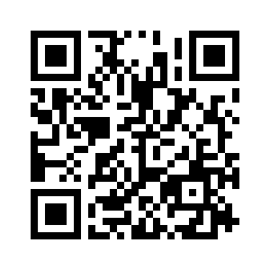

# 🤟🏽 AivanBMI

O projeto AivanBMI....

## 📺 Demonstração

<video width="100%" height="100%" controls>
  <source src="./assets/BMI.mp4" type="video/mp4">
</video>

## 💻 Tech Stack:

## 🚀 Referência/Material

- [Youtube](https://www.youtube.com/watch?v=UBYqkpsafyI)

## 🔗 Licença

- [MIT License](https://choosealicense.com/licenses/mit/)

## ⭐ Suporte/Feedback

- Para suporte ou feedback, entrar em contato via email (ivan.rocha.0987@gmail.com) ou entre em contato via whatsapp (41) 98468-5317.

## 🚩 Autores

- [@IvanRocha](https://www.github.com/ivanrocha10)
- [@Larissakich](https://github.com/Larissakich)

## 🔥 Projeto

  Acesse o "AivanBMI" pelo QR:

  

Caso o QR não funcione, acesse <a href="https://ivanrocha10.github.io/AivanBMI/">aqui</a>

