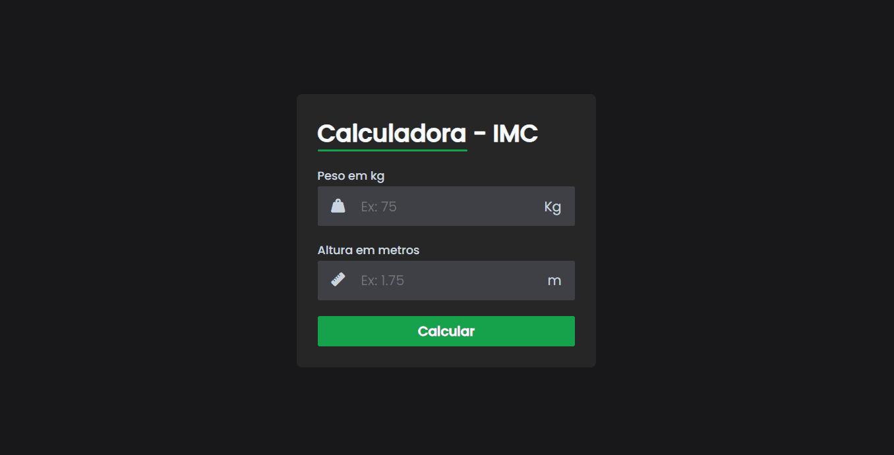

# 🤟🏽 BMI

O Projeto BMI foi desenvolvido com o objetivo de auxiliar os usuários na identificação de problemas relacionados ao peso, como sobrepeso ou baixo peso, ambos extremamente prejudiciais à saúde. A ferramenta utiliza tecnologias como JavaScript, HTML e CSS para proporcionar uma experiência interativa e eficaz.
 
 
O funcionamento do projeto é simples: os usuários acessam o site e inserem suas informações de peso e altura. Em seguida, ao clicarem no botão "calcular", são apresentadas informações relevantes, como o Índice de Massa Corporal (IMC) e uma análise sobre o peso, indicando se está dentro dos parâmetros saudáveis, se há magreza extrema, obesidade ou se está tudo bem.
 
 
Além disso, o projeto disponibiliza um link para mais informações sobre o IMC, oferecendo um breve resumo sobre sua importância e os riscos à saúde associados a diferentes faixas de IMC. Este recurso permite aos usuários compreender melhor os resultados e tomar medidas adequadas para cuidar da saúde física.

## 📺 Demonstração

## 💻 Tech Stack

## 🚀 Referência/Material

- [Youtube](https://www.youtube.com/watch?v=UBYqkpsafyI)
- [Google](https://mundoeducacao.uol.com.br/saude-bem-estar/imc.htm)

## 🔗 Licença

- [MIT License](https://choosealicense.com/licenses/mit/)

## ⭐ Suporte/Feedback

- E-mail: ivan.rocha.0987@gmail.com
- Whatsapp: (41) 98468-5317.

## 🚩 Autores

- [@IvanRocha](https://www.github.com/ivanrocha10)
- [@Larissakich](https://github.com/Larissakich)

## 🔥 Projeto

  Acesse o "BMI" pelo QR:

  

Caso o QR não funcione, acesse <a href="https://bmi-calculator-ten-mu.vercel.app/">aqui</a>

